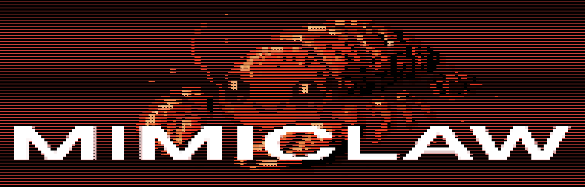
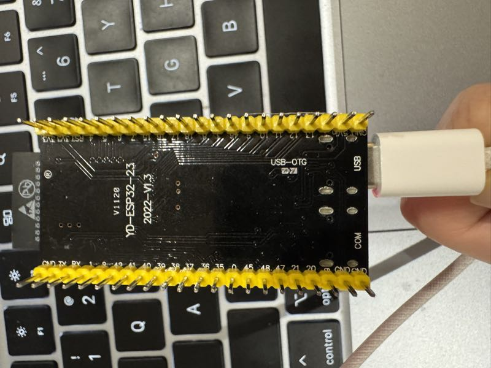

# MimiClaw: $5チップで動くポケットAIアシスタント

<p align="center">
  
</p>

<p align="center">
  <a href="LICENSE"></a>
  <a href="https://deepwiki.com/memovai/mimiclaw"></a>
  <a href="https://discord.gg/r8ZxSvB8Yr"></a>
  <a href="https://x.com/ssslvky"></a>
</p>

<p align="center">
  <strong><a href="README.md">English</a> | <a href="README_CN.md">中文</a> | <a href="README_JA.md">日本語</a></strong>
</p>

**$5チップ上の世界初のAIアシスタント（OpenClaw）。Linuxなし、Node.jsなし、純粋なCのみ。**

MimiClawは小さなESP32-S3ボードをパーソナルAIアシスタントに変えます。USB電源に接続し、WiFiにつなげて、Telegramから話しかけるだけ — どんなタスクも処理し、ローカルメモリで時間とともに成長します — すべて親指サイズのチップ上で。

## MimiClawの特徴

- **超小型** — Linux不要、Node.js不要、無駄なし — 純粋なCのみ
- **便利** — Telegramでメッセージを送るだけ、あとはお任せ
- **忠実** — メモリから学習し、再起動しても忘れない
- **省エネ** — USB給電、0.5W、24時間365日稼働
- **お手頃** — ESP32-S3ボード1枚、$5、それだけ

## 仕組み


Telegramでメッセージを送ると、ESP32-S3がWiFi経由で受信し、エージェントループに送ります — LLMが思考し、ツールを呼び出し、メモリを読み取り — 返答を送り返します。**Anthropic (Claude)** と **OpenAI (GPT)** の両方をサポートし、実行時に切り替え可能です。すべてが$5のチップ上で動作し、データはすべてローカルのFlashに保存されます。

## クイックスタート

### 必要なもの

- **ESP32-S3開発ボード**（16MB Flash + 8MB PSRAM搭載、例：小智AIボード、約$10）
- **USB Type-Cケーブル**
- **Telegram Botトークン** — Telegramで[@BotFather](https://t.me/BotFather)に話しかけて作成
- **Anthropic APIキー** — [console.anthropic.com](https://console.anthropic.com)から取得、または **OpenAI APIキー** — [platform.openai.com](https://platform.openai.com)から取得

### インストール

```bash
# まずESP-IDF v5.5+をインストールしてください:
# https://docs.espressif.com/projects/esp-idf/en/v5.5.2/esp32s3/get-started/

git clone https://github.com/memovai/mimiclaw.git
cd mimiclaw

idf.py set-target esp32s3
```

<details>
<summary>Ubuntu インストール</summary>

推奨ベースライン:

- Ubuntu 22.04/24.04
- Python >= 3.10
- CMake >= 3.16
- Ninja >= 1.10
- Git >= 2.34
- flex >= 2.6
- bison >= 3.8
- gperf >= 3.1
- dfu-util >= 0.11
- `libusb-1.0-0`, `libffi-dev`, `libssl-dev`

Ubuntu でのインストールとビルド:

```bash
sudo apt-get update
sudo apt-get install -y git wget flex bison gperf python3 python3-pip python3-venv \
  cmake ninja-build ccache libffi-dev libssl-dev dfu-util libusb-1.0-0

./scripts/setup_idf_ubuntu.sh
./scripts/build_ubuntu.sh
```

</details>

<details>
<summary>macOS インストール</summary>

推奨ベースライン:

- macOS 12/13/14
- Xcode Command Line Tools
- Homebrew
- Python >= 3.10
- CMake >= 3.16
- Ninja >= 1.10
- Git >= 2.34
- flex >= 2.6
- bison >= 3.8
- gperf >= 3.1
- dfu-util >= 0.11
- `libusb`, `libffi`, `openssl`

macOS でのインストールとビルド:

```bash
xcode-select --install
/bin/bash -c "$(curl -fsSL https://raw.githubusercontent.com/Homebrew/install/HEAD/install.sh)"

./scripts/setup_idf_macos.sh
./scripts/build_macos.sh
```

</details>

### 設定

MimiClawは**2層設定**を採用しています：`mimi_secrets.h`でビルド時のデフォルト値を設定し、シリアルCLIで実行時にオーバーライドできます。CLI設定値はNVS Flashに保存され、ビルド時の値より優先されます。

```bash
cp main/mimi_secrets.h.example main/mimi_secrets.h
```

`main/mimi_secrets.h`を編集：

```c
#define MIMI_SECRET_WIFI_SSID       "WiFi名"
#define MIMI_SECRET_WIFI_PASS       "WiFiパスワード"
#define MIMI_SECRET_TG_TOKEN        "123456:ABC-DEF1234ghIkl-zyx57W2v1u123ew11"
#define MIMI_SECRET_API_KEY         "sk-ant-api03-xxxxx"
#define MIMI_SECRET_MODEL_PROVIDER  "anthropic"     // "anthropic" または "openai"
#define MIMI_SECRET_SEARCH_KEY      ""              // 任意：Brave Search APIキー
#define MIMI_SECRET_TAVILY_KEY      ""              // 任意：Tavily APIキー（優先）
#define MIMI_SECRET_PROXY_HOST      ""              // 任意：例 "10.0.0.1"
#define MIMI_SECRET_PROXY_PORT      ""              // 任意：例 "7897"
```

ビルドとフラッシュ：

```bash
# フルビルド（mimi_secrets.h変更後はfullclean必須）
idf.py fullclean && idf.py build

# シリアルポートを確認
ls /dev/cu.usb*          # macOS
ls /dev/ttyACM*          # Linux

# フラッシュとモニター（PORTをあなたのポートに置き換え）
# USBアダプタ：おそらく /dev/cu.usbmodem11401（macOS）または /dev/ttyACM0（Linux）
idf.py -p PORT flash monitor
```

> **重要：正しいUSBポートに接続してください！** ほとんどのESP32-S3ボードには2つのUSB-Cポートがあります。**USB**（ネイティブUSB Serial/JTAG）と書かれたポートを使用してください。**COM**（外部UARTブリッジ）と書かれたポートは使わないでください。間違ったポートに接続するとフラッシュ/モニターが失敗します。
>
> <details>
> <summary>参考画像を表示</summary>
>
> 
>
> </details>

### CLIコマンド（UART/COMポート経由）

シリアル接続で設定やデバッグができます。**設定コマンド**により再コンパイル不要で設定変更可能 — USBケーブルを挿すだけ。

**実行時設定**（NVSに保存、ビルド時のデフォルト値をオーバーライド）：

```
mimi> wifi_set MySSID MyPassword   # WiFiネットワークを変更
mimi> set_tg_token 123456:ABC...   # Telegram Botトークンを変更
mimi> set_api_key sk-ant-api03-... # APIキーを変更（AnthropicまたはOpenAI）
mimi> set_model_provider openai    # プロバイダーを切替（anthropic|openai）
mimi> set_model gpt-4o             # LLMモデルを変更
mimi> set_proxy 127.0.0.1 7897    # HTTPプロキシを設定
mimi> clear_proxy                  # プロキシを削除
mimi> set_search_key BSA...        # Brave Search APIキーを設定
mimi> set_tavily_key tvly-...      # Tavily APIキーを設定（優先）
mimi> config_show                  # 全設定を表示（マスク付き）
mimi> config_reset                 # NVSをクリア、ビルド時デフォルトに戻す
```

**デバッグ・メンテナンス：**

```
mimi> wifi_status              # 接続されていますか？
mimi> memory_read              # ボットが何を覚えているか確認
mimi> memory_write "内容"       # MEMORY.mdに書き込み
mimi> heap_info                # 空きRAMはどれくらい？
mimi> session_list             # 全チャットセッションを一覧
mimi> session_clear 12345      # 会話を削除
mimi> heartbeat_trigger           # ハートビートチェックを手動トリガー
mimi> cron_start                  # cronスケジューラを今すぐ開始
mimi> restart                     # 再起動
```

### USB（JTAG）vs UART：どのポートで何をするか

ほとんどの ESP32-S3 開発ボードには **2つの USB-C ポート**があります：

| ポート | 用途 |
|--------|------|
| **USB**（JTAG） | `idf.py flash`、JTAGデバッグ |
| **COM**（UART） | **REPL CLI**、シリアルコンソール |

> **REPLにはUART（COM）ポートが必要です。** USB（JTAG）ポートは対話的なREPL入力をサポートしません。

<details>
<summary>ポート詳細と推奨ワークフロー</summary>

| ポート | ラベル | プロトコル |
|--------|--------|------------|
| **USB** | USB / JTAG | ネイティブ USB Serial/JTAG |
| **COM** | UART / COM | 外部 UART ブリッジ（CP2102/CH340） |

ESP-IDFコンソールはデフォルトでUART出力に設定されています（`CONFIG_ESP_CONSOLE_UART_DEFAULT=y`）。

**両方のポートを同時に接続している場合：**

- USB（JTAG）ポートはフラッシュ/ダウンロードを処理し、補助シリアル出力を提供
- UART（COM）ポートはREPL用のメインインタラクティブコンソールを提供
- macOS では両ポートとも `/dev/cu.usbmodem*` または `/dev/cu.usbserial-*` として表示 — `ls /dev/cu.usb*` で確認
- Linux では USB（JTAG）は通常 `/dev/ttyACM0`、UART は通常 `/dev/ttyUSB0`

**推奨ワークフロー：**

```bash
# USB（JTAG）ポートでフラッシュ
idf.py -p /dev/cu.usbmodem11401 flash

# UART（COM）ポートでREPLを開く
idf.py -p /dev/cu.usbserial-110 monitor
# または任意のシリアルターミナル：screen、minicom、PuTTY（ボーレート 115200）
```

</details>

## メモリ

MimiClawはすべてのデータをプレーンテキストファイルとして保存します。直接読み取り・編集可能です：

| ファイル | 説明 |
|----------|------|
| `SOUL.md` | ボットの性格 — 編集して振る舞いを変更 |
| `USER.md` | あなたの情報 — 名前、好み、言語 |
| `MEMORY.md` | 長期記憶 — ボットが常に覚えておくべきこと |
| `HEARTBEAT.md` | タスクリスト — ボットが定期的にチェックして自律的に実行 |
| `cron.json` | スケジュールジョブ — AIが作成した定期・単発タスク |
| `2026-02-05.md` | 日次メモ — 今日あったこと |
| `tg_12345.jsonl` | チャット履歴 — ボットとの会話 |

## ツール

MimiClawはAnthropicとOpenAI両方のツール呼び出しをサポート — LLMは会話中にツールを呼び出し、タスクが完了するまでループします（ReActパターン）。

| ツール | 説明 |
|--------|------|
| `web_search` | Tavily（優先）またはBraveでウェブ検索し、最新情報を取得 |
| `get_current_time` | HTTP経由で現在の日時を取得し、システムクロックを設定 |
| `cron_add` | 定期または単発タスクをスケジュール（LLMが自律的にcronジョブを作成） |
| `cron_list` | スケジュール済みのcronジョブを一覧表示 |
| `cron_remove` | IDでcronジョブを削除 |

ウェブ検索を有効にするには、`mimi_secrets.h`で[Tavily APIキー](https://app.tavily.com/home)（優先、`MIMI_SECRET_TAVILY_KEY`）または[Brave Search APIキー](https://brave.com/search/api/)（`MIMI_SECRET_SEARCH_KEY`）を設定してください。

## Cronタスク

MimiClawにはcronスケジューラが内蔵されており、AIが自律的にタスクをスケジュールできます。LLMは`cron_add`ツールで定期ジョブ（「N秒ごと」）や単発ジョブ（「UNIXタイムスタンプで指定」）を作成できます。ジョブが発火すると、メッセージがエージェントループに注入され、AIが起動してタスクを処理・応答します。

ジョブはSPIFFS（`cron.json`）に永続化され、再起動後も保持されます。活用例：日次サマリー、定期リマインダー、スケジュールチェック。

## ハートビート

ハートビートサービスはSPIFFS上の`HEARTBEAT.md`を定期的に読み取り、アクション可能なタスクがあるかチェックします。未完了の項目（空行、見出し、チェック済み`- [x]`以外）が見つかると、エージェントループにプロンプトを送信し、AIが自律的に処理します。

これによりMimiClawはプロアクティブなアシスタントになります — `HEARTBEAT.md`にタスクを書き込めば、次のハートビートサイクルで自動的に拾い上げて実行します（デフォルト：30分ごと）。

## その他の機能

- **WebSocketゲートウェイ** — ポート18789、LAN内から任意のWebSocketクライアントで接続
- **OTAアップデート** — WiFi経由でファームウェア更新、USB不要
- **デュアルコア** — ネットワークI/OとAI処理が別々のCPUコアで動作
- **HTTPプロキシ** — CONNECTトンネル対応、制限付きネットワークに対応
- **マルチプロバイダー** — Anthropic (Claude) と OpenAI (GPT) の両方をサポート、実行時に切り替え可能
- **Cronスケジューラ** — AIが定期・単発タスクを自律的にスケジュール、再起動後も永続化
- **ハートビート** — タスクファイルを定期チェックし、AIを自律的に駆動
- **ツール呼び出し** — ReActエージェントループ、両プロバイダーでツール呼び出し対応

## 開発者向け

技術的な詳細は`docs/`フォルダにあります：

- **[docs/ARCHITECTURE.md](docs/ARCHITECTURE.md)** — システム設計、モジュール構成、タスクレイアウト、メモリバジェット、プロトコル、Flashパーティション
- **[docs/TODO.md](docs/TODO.md)** — 機能ギャップとロードマップ
- **[docs/im-integration/](docs/im-integration/README.md)** — IMチャネル統合ガイド（Feishuなど）

## 貢献

Issue や Pull Request を作成する前に、**[CONTRIBUTING.md](CONTRIBUTING.md)** をご確認ください。

## コントリビューター

MimiClaw に貢献してくれた皆さんに感謝します。

<a href="https://github.com/memovai/mimiclaw/graphs/contributors">
  
</a>

## ライセンス

MIT

## 謝辞

[OpenClaw](https://github.com/openclaw/openclaw)と[Nanobot](https://github.com/HKUDS/nanobot)にインスパイアされました。MimiClawはコアAIエージェントアーキテクチャを組み込みハードウェア向けに再実装しました — Linuxなし、サーバーなし、$5のチップだけ。

## Star History

<a href="https://www.star-history.com/?repos=memovai%2Fmimiclaw&type=date&legend=top-left">
 <picture>
   <source media="(prefers-color-scheme: dark)" srcset="https://api.star-history.com/image?repos=memovai/mimiclaw&type=date&theme=dark&legend=top-left" />
   <source media="(prefers-color-scheme: light)" srcset="https://api.star-history.com/image?repos=memovai/mimiclaw&type=date&legend=top-left" />
   
 </picture>
</a>
